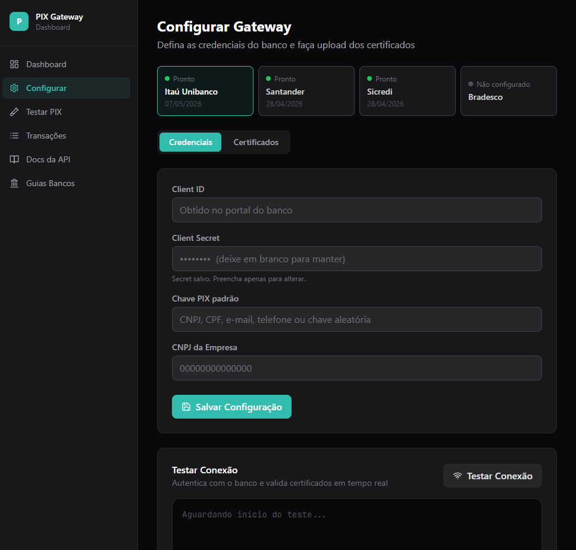
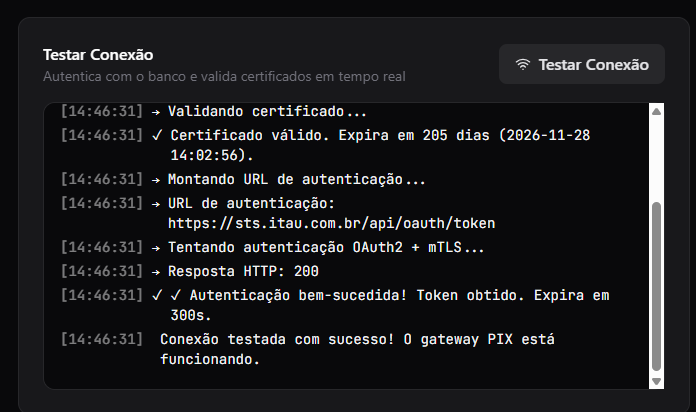
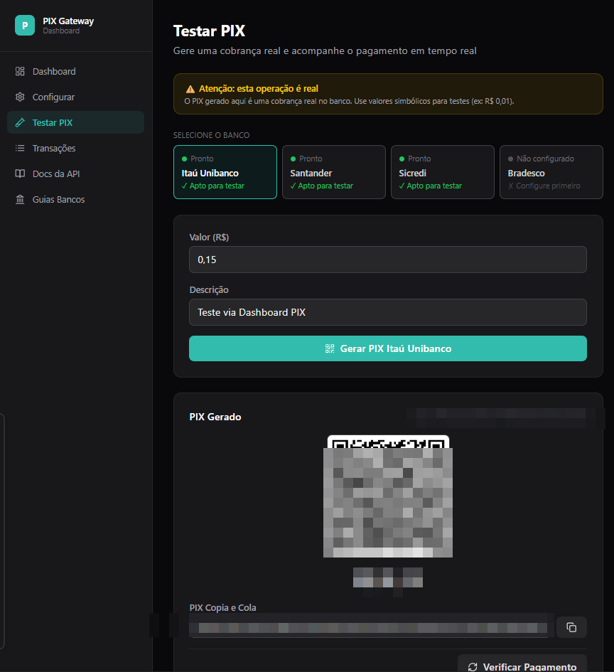
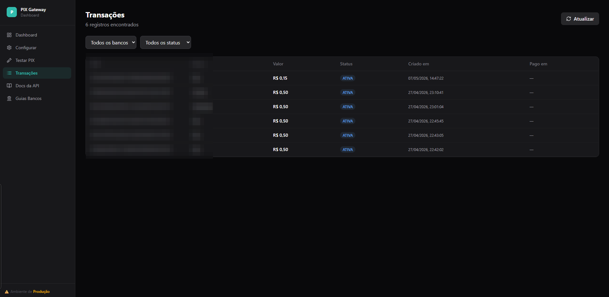
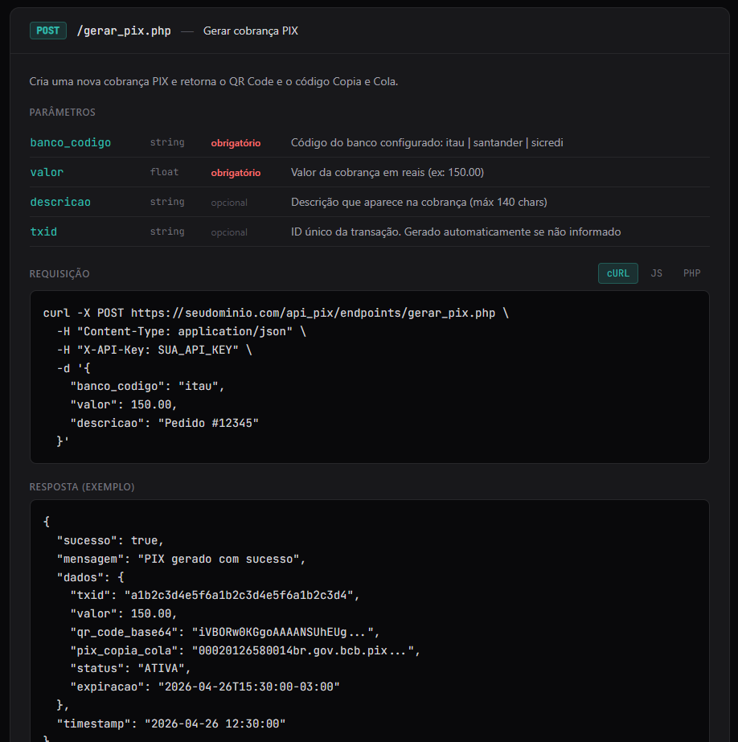

# DevBoost PIX Gateway

**Gateway PIX self-hosted para PHP — integre Itaú, Santander, Sicredi e Bradesco com uma única API.**

> Sem mensalidade de gateway. Sem intermediário. Você controla tudo.

---

## O que é isso?

O **DevBoost PIX Gateway** é um sistema completo, pronto para produção, que você instala no seu próprio servidor e usa para gerar cobranças PIX diretamente nas APIs oficiais dos bancos — sem depender de gateways de pagamento de terceiros como PagSeguro, Mercado Pago ou similares.

Você recebe o código-fonte completo, com painel de administração incluso.

---

## Screenshots

| Dashboard | Configurar Bancos |
|---|---|
|  |  |

| Teste de Conexão em Tempo Real | Testar PIX — QR Code Real |
|---|---|
|  |  |

| Histórico de Transações | Documentação da API Integrada |
|---|---|
|  |  |

---

## Bancos suportados

| Banco | Status | Autenticação |
|---|---|---|
| **Itaú Unibanco** | ✅ Produção | OAuth2 + mTLS |
| **Santander** | ✅ Produção | OAuth2 + mTLS |
| **Sicredi** | ✅ Produção | OAuth2 + mTLS |
| **Bradesco** | 🔧 Em breve | — |

---

## O que está incluído

- **Painel de Administração** (React + Tailwind) — configure credenciais, faça upload de certificados e monitore tudo via browser
- **API PIX completa** — endpoints para gerar, consultar e cancelar cobranças
- **Teste de conexão em tempo real** — terminal interativo que autentica com o banco e valida certificados antes de ir para produção
- **Documentação da API integrada** — exemplos em cURL, JavaScript e PHP prontos para copiar
- **Guias de configuração por banco** — passo a passo para obter credenciais no portal de cada banco
- **Histórico de transações** — consulte todas as cobranças geradas, filtradas por banco e status
- **Docker incluso** — sobe o ambiente completo com `docker-compose up`
- **Código-fonte 100% aberto** — sem ofuscação, sem licença de runtime, sem chamada para servidor externo

---

## Como funciona

```
Seu sistema  →  POST /api_pix/endpoints/gerar_pix.php
                  ↓
            PIX Gateway (seu servidor)
                  ↓
            API do banco (Itaú, Santander, Sicredi...)
                  ↓
            QR Code + Copia e Cola retornados
```

Uma única chamada HTTP com `banco_codigo`, `valor` e `descricao` — o gateway cuida de toda a autenticação OAuth2 + mTLS, geração do txid, e retorna o QR Code pronto.

---

## Exemplo de integração

```bash
curl -X POST https://seudominio.com/api_pix/endpoints/gerar_pix.php \
  -H "Content-Type: application/json" \
  -H "X-API-Key: SUA_API_KEY" \
  -d '{
    "banco_codigo": "itau",
    "valor": 150.00,
    "descricao": "Pedido #12345"
  }'
```

```json
{
  "sucesso": true,
  "mensagem": "PIX gerado com sucesso",
  "dados": {
    "txid": "ABC123...",
    "valor": 150.00,
    "qr_code_base64": "iVBORw0KGgo...",
    "pix_copia_cola": "00020101021226...",
    "status": "ATIVA",
    "expiracao": "2026-05-07T15:30:00-03:00"
  }
}
```

---

## Requisitos do servidor

- PHP 7.4+ com extensões: `openssl`, `pdo_mysql`, `curl`
- MySQL 5.7+ ou MariaDB 10.3+
- Apache ou Nginx (vhost incluso)
- Certificados mTLS fornecidos pelo portal do seu banco

Ou simplesmente use o **Docker incluso** — zero configuração manual.

---

## O que você NÃO paga mais

| Custo eliminado | Estimativa mensal |
|---|---|
| Taxa por transação (2~3%) | Variável — proporcional ao seu faturamento |
| Plano de gateway (PagSeguro, Pagar.me etc.) | R$ 0 a R$ 500+/mês |
| Dependência de terceiros para ficar no ar | Priceless |

---

## Para quem é

✅ Desenvolvedor PHP que integra sistemas para clientes  
✅ SaaS ou e-commerce que quer eliminar a taxa por transação  
✅ Empresa que precisa de múltiplas contas PIX em bancos diferentes  
✅ Quem quer ter controle total sobre o fluxo de pagamento

---

## Licença

Licença vitalícia — pague uma vez, use para sempre, em quantos projetos quiser.  
Código-fonte completo entregue sem restrições de runtime ou assinatura.

---

*DevBoost — ferramentas para desenvolvedores que precisam de produção, não de promessa.*
